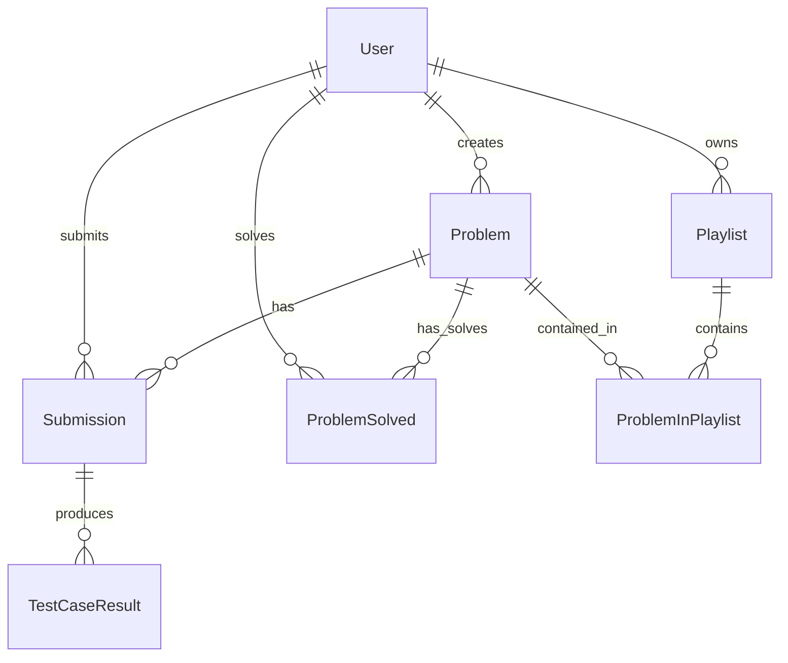

# LeetLab - Project Context

LeetLab is a self-hosted platform inspired by LeetCode, designed to help users prepare for coding interviews and improve their programming skills. It supports user authentication, code execution in multiple languages (JavaScript, Java, Python) via a sandbox environment, and admin CRUD capabilities for programming problems.

---

## File Structure

The project is structured as a monorepo containing a `backend` server and a `frontend` React application.

```text
leetlab-main/
├── backend/
│   ├── prisma/
│   │   └── schema.prisma         # Database schema (PostgreSQL via Prisma ORM)
│   ├── src/
│   │   ├── controllers/
│   │   │   ├── auth.controller.js
│   │   │   ├── executeCode.controller.js
│   │   │   ├── playlist.controller.js
│   │   │   ├── problem.controller.js
│   │   │   ├── profile.controller.js
│   │   │   └── submission.controller.js
│   │   ├── libs/
│   │   │   ├── db.js                 # Prisma client instance
│   │   │   └── judge0.lib.js         # Integration library for Judge0 CE API
│   │   ├── middleware/
│   │   │   └── auth.middleware.js    # JWT validation and authorization helpers
│   │   ├── routes/
│   │   │   ├── auth.routes.js        # Auth routing (/api/v1/auth)
│   │   │   ├── executeCode.routes.js # Sandbox execution routing (/api/v1/execute-code)
│   │   │   ├── playlist.routes.js    # Playlist routing (/api/v1/playlist)
│   │   │   ├── problem.routes.js     # Problem CRUD routing (/api/v1/problems)
│   │   │   ├── profile.routes.js     # Profile routing (/api/v1/profile)
│   │   │   └── submission.routes.js   # Code submission routing (/api/v1/submission)
│   │   └── index.js                  # Main server entry point
│   ├── package.json
│   └── problem.json
└── frontend/
    ├── public/
    ├── src/
    │   ├── assets/
    │   ├── components/               # Shareable components
    │   │   ├── AddToPlaylist.jsx
    │   │   ├── AdminRoute.jsx        # Route guard for admin-only pages
    │   │   ├── AuthImagePattern.jsx
    │   │   ├── CreatePlaylistModal.jsx
    │   │   ├── CreateProblemForm.jsx # Multi-language problem configuration form
    │   │   ├── LogoutButton.jsx
    │   │   ├── Navbar.jsx
    │   │   ├── ProblemTable.jsx      # Problem list table with search & filters
    │   │   ├── Submission.jsx
    │   │   └── SubmissionList.jsx
    │   ├── layout/
    │   │   └── Layout.jsx
    │   ├── lib/
    │   │   └── axios.js              # Pre-configured Axios instance for backend queries
    │   ├── page/                     # Page components
    │   │   ├── AddProblem.jsx
    │   │   ├── HomePage.jsx          # Problem listing dashboard
    │   │   ├── LandingPage.jsx       # Dynamic landing page with animations
    │   │   ├── LoginPage.jsx
    │   │   ├── PlaylistsPage.jsx     # Saved playlists manager
    │   │   ├── ProblemPage.jsx       # Problem solving page with Monaco Editor
    │   │   ├── ProfilePage.jsx       # User Profile dashboard
    │   │   └── SignUpPage.jsx
    │   ├── store/                    # Zustand stores for state management
    │   │   ├── useAction.js
    │   │   ├── useAuthStore.js
    │   │   ├── useExecutionStore.js
    │   │   ├── usePlaylistStore.js
    │   │   ├── useProblemStore.js
    │   │   ├── useProfileStore.js
    │   │   └── useSubmissionStore.js
    │   ├── App.jsx                   # Frontend router and authentication checkpoint
    │   ├── index.css
    │   └── main.jsx
    ├── package.json
    └── vite.config.js
```

---

## Tech Stack (PERN)

### Backend
- **Node.js** & **Express**: Lightweight server framework.
- **PostgreSQL**: Relational database.
- **Prisma ORM**: Modern database client and schema migration tool.
- **jsonwebtoken & bcryptjs**: Handles secure password hashing and stateless token-based authorization.
- **Judge0 CE API**: Sandboxed code compiler and executor.

### Frontend
- **React 19**: Modern declarative client UI logic.
- **Vite**: Ultra-fast build tool and bundler.
- **Zustand**: Minimalist and fast global state management.
- **React Router DOM**: Client-side application routing.
- **Tailwind CSS v4 & DaisyUI v5**: Utility-first CSS framework and component library for modern, cohesive designs.
- **Monaco Editor**: Integrated developer coding workspace (`@monaco-editor/react`).
- **React Hook Form & Zod**: Form management and schema-based input validation.
- **Axios**: Promised-based HTTP client for requests to the REST API.
- **React Hot Toast**: Beautiful notification banners.

---

## Database Schema (Prisma)

The application models its relationships using Prisma:



### Main Models

1. **User**
   - Unique identifier (`id` UUID), `email`, hashed `password`, `name`, `image`.
   - `role` Enum (`USER`, `ADMIN`): Restricts access to control features like problem management.

2. **Problem**
   - Meta fields: `title`, `description`, `difficulty` (`EASY`, `MEDIUM`, `HARD`), `tags` (array of strings), `constraints`, `hints`, `editorial`.
   - Structural fields: `examples` (JSON), `testcases` (JSON inputs and outputs), `codeSnippets` (JSON boilerplates), `referenceSolutions` (JSON accepted code for verification).
   - Relationship: Linked to the creator `User` (on-delete cascade).

3. **Submission**
   - Tracks a code submission: `userId`, `problemId`, `sourceCode` (JSON), `language` (e.g. Python, Javascript, Java), status outputs (`stdin`, `stdout`, `stderr`, `compileOutput`, `status`, `memory`, `time`).

4. **TestCaseResult**
   - Result for individual test case execution inside a submission: `submissionId`, `testCase` index, `passed` (boolean), `stdout`, `expected`, `stderr`, `status`, `memory`, and `time`.

5. **ProblemSolved**
   - Junction table linking a `User` and a `Problem` indicating a successful solve. Requires a unique composite constraint `@@unique([userId, problemId])`.

6. **Playlist** & **ProblemInPlaylist**
   - Allows users to organize lists of problems (`Playlist`). The join table `ProblemInPlaylist` matches specific problems to their playlists with cascade deletions.

---

## Implemented Features

### 1. User Dashboard (`HomePage` / `ProblemTable`)
- Displays all created problems to authenticated users.
- Solved indicators (checkboxes) appear green if the user is in the `ProblemSolved` relation for that problem.
- Robust client-side filtering by **title search**, **difficulty level**, and **individual tags**.
- Client-side pagination (currently configured to 5 problems per page).
- **Admin utilities**: Admins see contextual buttons to delete problems or navigate to the edit layout.
- Save to playlist button allows users to queue questions to custom playlists.

### 2. Create Problem (`AddProblem` / `CreateProblemForm`)
- An admin-only feature guarded by `AdminRoute` and `checkAdmin` middleware.
- Full Monaco-editor integration for writing standard boilerplates (`codeSnippets`) and code solutions (`referenceSolutions`).
- **Judge0 Verification on Create**: When saving a new problem, the backend compiles and tests the submitted `referenceSolutions` against all custom `testcases` using Judge0. The problem is only persisted if the reference solutions compile and pass all test runs successfully.
- Includes a "Load Sample" helper that pre-populates form data with predefined arrays/string sample configurations (e.g. *Climbing Stairs*, *Valid Palindrome*).

### 3. Delete Problem
- Admins can delete problems directly from the problems table.
- The deletion request is processed through the `/api/v1/problems/delete-problem/:id` route, triggering a cascade delete to clean up references, submissions, test outcomes, and user playlists.

### 4. Sandbox Code Execution and Submission (Pending details)
- Allows users to code directly on the platform and run tests before final submission.
- Real-time communication with Judge0 execution nodes.

### 5. User Profile Section
- **Profile Endpoint (`/api/v1/profile`)**: Provides a unified payload containing user stats (total solved and system totals by difficulty), the 20 most recent submissions, and playlists with problem counts.
- **Glassmorphism Header**: Beautiful dashboard top card displaying user details (image avatar/initial placeholder, email, and role badge).
- **Radial & Progress Metrics**: Compares the user's solved metrics against database totals per difficulty (Easy, Medium, Hard). Includes a circular progress gauge.
- **Recent Submissions & Monaco Modal**: Lists user's history. Clicking "View Code" opens a read-only popup overlay showcasing Monaco Editor highlighted code matching the submission language.
- **Playlists Widget**: Lists custom playlists created by the user with aggregate problem counts.

### 6. Interactive Landing Page
- **Hero Intro**: Features fade-in slide-up layouts showcasing CodingMate algorithmic highlights and a glowing "Start Solving" CTA.
- **AI Coach Mockup Showcase**: Renders a floating chat bubble preview teasing simulated AI code suggestions (e.g. time/space optimization and code refactoring walkthroughs) using Framer Motion animations.
- **Highlights grid**: 3-column interactive responsive card grid for compilers, lists, and metrics.

### 7. Playlist Manager (/playlists)
- **Grid Layout**: Displays user-created problem collections and count metrics.
- **Modal Integrations**: Leverages creation pop-ups to declare new playlists on the fly.
- **Expandable Collections**: Expanding a playlist details card fetches problems inside it, lets users run code direct-links, or deletes playlist items/relations.


